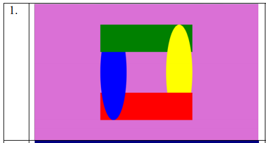
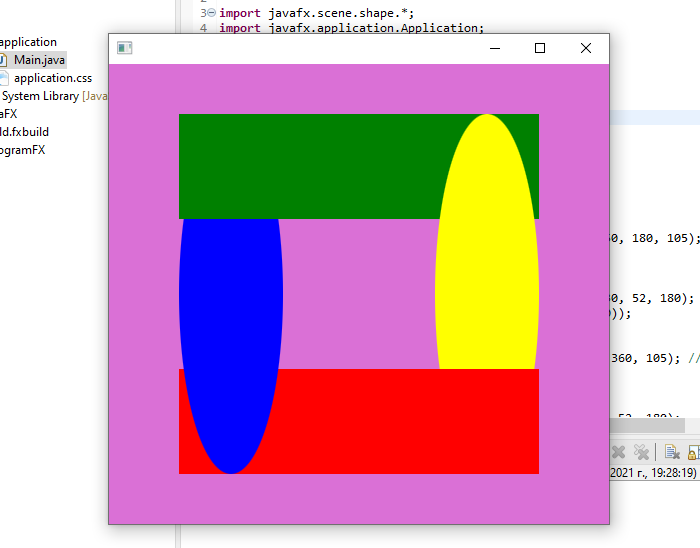

# Лабораторна робота №1

## Бухаленков Дмитро КП-81 (варіант 1):



## Результат:



## Код програми:

```java
package application;

import javafx.scene.shape.*;
import javafx.application.Application;
import javafx.stage.Stage;
import javafx.scene.Group;
import javafx.scene.Scene;
import javafx.scene.paint.Color;

public class Main extends Application {
	@Override
	public void start(Stage primaryStage) {
		try {
			Group root = new Group();
			Scene scene = new Scene(root, 500, 460);
      
			Rectangle greenRect1 = new Rectangle(250, 50, 180, 105);
			greenRect1.setFill(Color.rgb(0, 128, 0));
			root.getChildren().add(greenRect1);

			Ellipse yellowEllipse = new Ellipse(378, 230, 52, 180);
			yellowEllipse.setFill(Color.rgb(255, 255, 0));
			root.getChildren().add(yellowEllipse);

			Rectangle redRect = new Rectangle(70, 305, 360, 105);
			redRect.setFill(Color.rgb(255, 0, 0));
			root.getChildren().add(redRect);

			Ellipse blueEllipse = new Ellipse(122, 230, 52, 180);
			blueEllipse.setFill(Color.rgb(0, 0, 255));
			root.getChildren().add(blueEllipse);

			Rectangle greenRect2 = new Rectangle(70, 50, 180, 105);
			greenRect2.setFill(Color.rgb(0, 128, 0));
			root.getChildren().add(greenRect2);

			scene.setFill(Color.rgb(218, 112, 214));
			
			primaryStage.setScene(scene);
			primaryStage.show();
		} catch (Exception e) {
			e.printStackTrace();
		}
	}

	public static void main(String[] args) {
		launch(args);
	}
}
```
